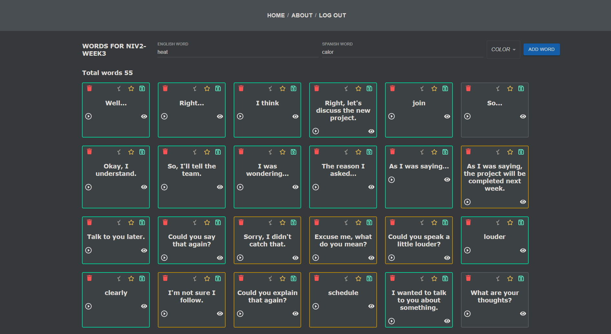

# Flash-Cards

### App creaed for memory words, recommended for memory words as too as studying other lenguage, for example english.



<ul>
<li>Listening sound of words</li>
<li>Countable words memory</li>
</ul>

IMPORTANT: It is necessary to have at least the latest stable version of Node and NPM. Make sure to have it in order to correctly install the necessary dependencies to run the project.

Boilerplate
The boilerplate has two folders: api and client. In these folders, you will find the code for the back-end and the front-end, respectively.

In the api folder, create a file named: .env with the following format:

```
DB_USER= root
DB_PASSWORD= password
DB_HOST= localhost
DB_PORT = 3306
DB_NAME = memoryword
PORT = 3001
```

Create a database with MySQL named memoryword.

## Installation

1. Clone this repository: `git clone https://github.com/Carlitossaul/Memory_Words.git`
2. Navigate to the project directory: `cd Words-API`
3. Install dependencies: `npm install`
4. Start the application: `npm start`

5. Navigate to the project directory: `cd words-client`
6. Install dependencies: `npm install`
7. Start the application: `npm run dev`

## Contributions

You can contribute to this project by forking and submitting a pull request.
